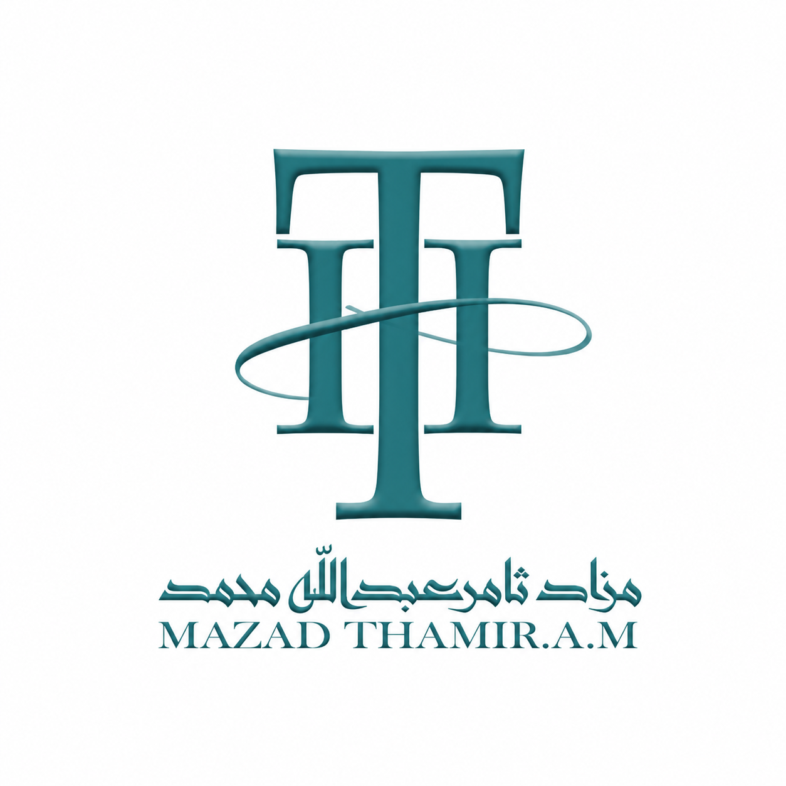

# Luxury Auction Logo Design

## Overview

This project showcases a premium logo design created for a luxury auction business in Qatar.  
The brand focuses on exclusive and high-end products such as luxury watches, fountain pens, and collectible items.

The main goal of this design was to create a sophisticated and memorable visual identity that represents elegance, trust, and luxury.

---

## Project Information

- **Project Type:** Logo Design
- **Industry:** Luxury Auction
- **Location:** Qatar
- **Design Software:** Adobe Illustrator

---

## Design Concept

The logo was designed with a focus on:

- Luxury and exclusivity
- Professional brand identity
- Elegant typography
- A timeless visual style
- Strong recognition across digital and print platforms

---

## Tools Used

- Adobe Illustrator

---

## Skills & Techniques

- Logo Design
- Brand Identity Design
- Luxury Branding
- Vector Design
- Typography
- Color Selection
- Adobe Illustrator

---

## Project Preview

### Main Logo

### Logo Mockup

.jpg)

---

## File Structure
Luxury-Auction-Logo-Design
│── README.md
│── logo.png
│── logo-mockup.jpg
│── logo-black.png
│── logo-white.png

---

## About The Designer

This project demonstrates my skills in creating professional visual identities and brand solutions for luxury businesses.

---

Thank you for viewing this project.
